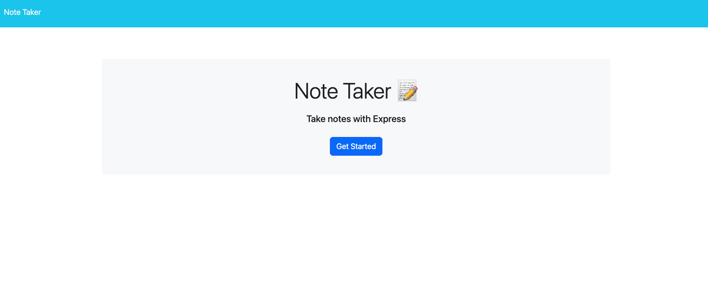
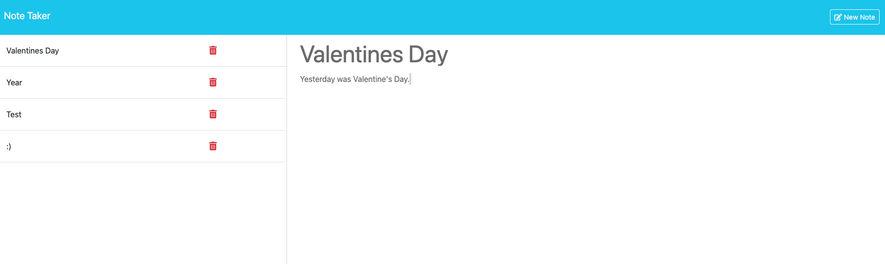

# Note Taker

An app to take notes, save and delete them.

## Image of a generated SVG

Image: 
Image 2: 

## A video walk through

Video: https://youtu.be/JGu-ybuZO8I

## Repo:

https://github.com/fswDevSteph/SVG-Logo-Maker

## Upcoming Iterations

1. As of Februrary 15th 2024, I will be adding the current date to display in the header within the month.
2. I will potentially add a date stamp the note was written above the text of.

## Contributers

Tutors
Tutors: Full names unknown.

## Known Issues:

N/A

## About Developer:

Stephanie Perroni is a full stack software development student who hopes to make meaningful and positively impactful contributions in the software development space.
